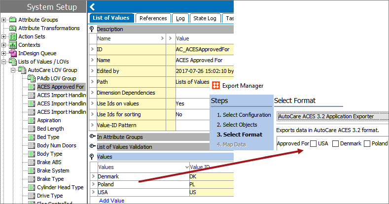

10. Add Country Codes to Approved for LOV (ACES Export Only)
============================================================

If ACES 3.2 Export will be used *and* the ApprovedFor tag in the header
will be populated as part of ACES Exports, this setup action must be
carried out.

The ACES Exporter includes an option to select countries that will be
populated in the ApprovedFor element of the export. The values to select
from are controlled by an LOV that is created as part of Easy Setup. The
LOV is created without values as each implementation must determine the
allowable values. Therefore, prior to running an export using the
ApprovedFor element, values must be added to the LOV with
ID=AC\_ACESApprovedFor.

The ACES standard allows for two character country codes only. The
exporter interface displays the value of the LOV, while the export
itself passes the value ID. Care must be taken to ensure that all value
IDs are exactly two characters, or the export could generate a file that
will fail validation on a downstream system.
