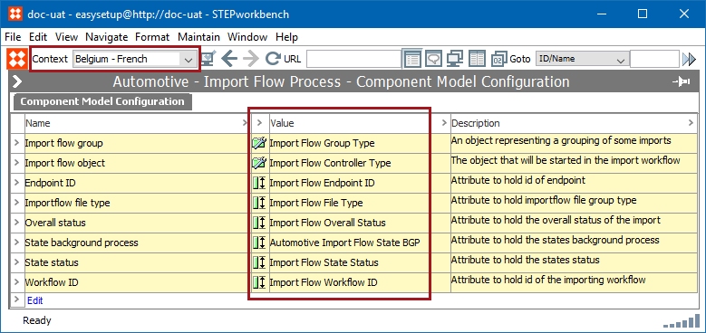
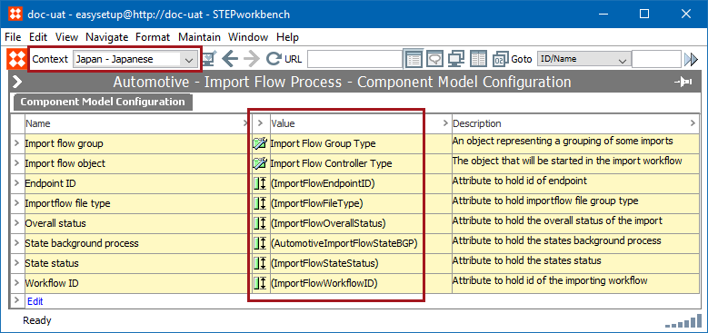

2. Run Easy Setup of Import Flow Process
========================================

The Import Flow Process is the framework for importing automotive files
across any of the standards. It only needs to be run once per system,
regardless of how many standards will be implemented. However, it must
be run *prior to* any of the Easy Setup functions for the standards.

Incoming automotive data files are modeled as entities in STEP. This
setup action creates the necessary entity object types, as well as the
attributes that will be available on the objects.

Configuration Steps
-------------------

Below are the steps necessary to complete Easy Setup of the Import Flow
Process:

1.  If an Easy Setup user will be utilized for maintaining a proper
    audit trail, log in to STEP as that user.
2.  Go to **Context**, and select the most commonly used context option
    from the dropdown.

When Easy Setup actions are run, any object and/or attributes created
will be populated with a respective name only for the context selected
when the actions are run. Therefore, when a different context is
selected, the default object and/or attribute name will display with
parentheses.

In the example below, the Automotive - Import Flow Process component
model is displayed using with the same context used when the Easy Setup
actions were run for the component.

Below, the same component model is displayed, but the context has been
changed, and the attribute value names display with parentheses.

1.  Go to **System Setup** \> **Component Models** \> **Automotive -
    Import Flow Process**.
2.  Right-click **Automotive - Import Flow Process** \> Select
    **Configure the import flow process**.

1.  A dialog will display stating the changes that will be made by
    running the process. If you would like to record the changes, you
    may do so by taking a screenshot of the dialog. When you are ready
    to start the configuration process, click the **OK** button.
2.  The system will create all necessary elements to support the Import
    Flow Process. This will typically take less than a minute, and when
    complete, a dialog will display listing each change that was made.
    Click the **OK** button to close the dialog and resume normal
    activities on the system.
