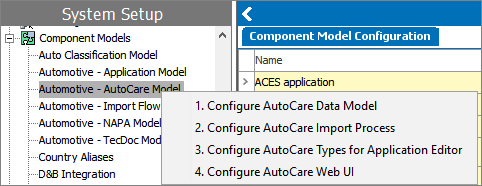
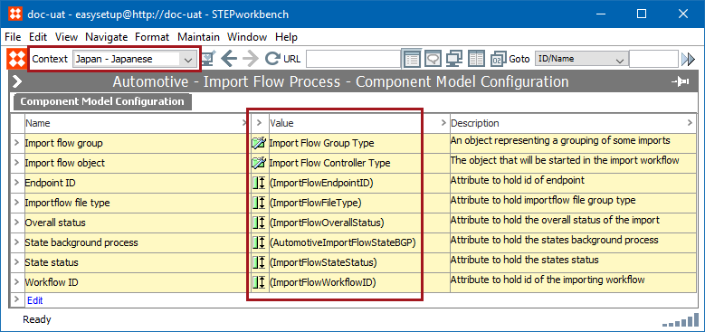

3. Run Easy Setup of Standards
==============================

Each standard has a component model designed to handle the creation of
all elements necessary to support the specific standard\'s core
functionality. Regardless of the standard being set up, each follows the
same process and has the following four actions that must be run
sequentially:

1.  Configure Data Model
2.  Configure Import Process
3.  Configure Types for Application Editor
4.  Configure Web UI

For example:



If an object already exists on a system, running Easy Setup will not
change it. Therefore, users can run Easy Setup as needed to deploy new
functionality, without risk of disrupting or changing current processes.
If manual changes have been made to an object following creation by Easy
Setup, these changes are retained if setup is subsequently re-run. This
also means that when enablement of new functionality requires changing
the setup of an existing object, that change must be made manually on
existing implementations (while Easy Setup can handle it automatically
in new implementations). Because of this, it is important to pay
attention to information included in patch notes and carry out any
manual configurations needed to enable new functionality.

A brief description is provided below about what each of the four setup
actions creates, with additional information available throughout this
and the Quick Start for Users section of this guide.

1.  **Configure Data Model:** Each standard has a supporting data model
    consisting of object types / hierarchies, attributes, LOVs, and
    references. This setup action creates the elements needed to support
    the data model.
2.  **Configure Import Process:** Each standard has multiple integration
    endpoints, workflows, business rules, and ID Structures used to
    support each type of import file.

-   In AutoCare, these are: ACES, PIES, Brand, PAdb, PCdb, Qdb, and
    VCdb.
-   In TecDoc, these are: Reference and Supplier.
-   In NAPA, these are: Application, Attribute, Interchange,
    Translation, and Vehicle.

Following configuration of the import process, an inbound integration
endpoint and corresponding workflow (with business rules) will be
created for each import type supported by the applicable standard, as
well as hotfolders for each of the files to be placed into for
processing.

If part and application data are imported into STEP without using the
proper ID structures, then errors will occur. Prior to importing, review
the **ID Structures in Importers** topic ([here]{.mcFormatColor
style="color: Blue;"}) within the **Automotive Reference Guide**.

In addition, a Web UI will be created that is pre-configured to provide
access to the workflows used to manage the imports after the files are
picked up by the hotfolders.

3.  **Configure Types for Application Editor:** An application lookup /
    editor is provided for each standard, which also contains support
    for mapping application records between the standards or from your
    own model to one or more standard models. This step of the setup
    populates the component model (Automotive - Application Model) that
    supports the mapping of application records between the various
    models, though additional configuration is required beyond this to
    enable the mapper functionality.

The population of this component model also drives the functionality of
the Web UI screens that are available for application search and editing
features, so this step is required to support application search
functionality in Web UI (even if application record editing or mapping
capabilities are not required).

4.  **Configure Web UI:** A starting configuration for application
    search and edit functionality is provided for each standard, via
    three screens that are configured in this setup action. Additional
    configuration of the Web UI is required to make use of the created
    screens, which is described later in this guide. When running this
    setup action, you must select a Web UI for the screens to be created
    within. During the previous Step 2 (Configure Import Process) a Web
    UI to manage imports for the standard is created. The screens can be
    added to that Web UI, or to any other Web UI. If multiple models are
    implemented, it may be useful to have application search / edit /
    mapping functions for all models available in a single Web UI, hence
    the option to choose which Web UI to create the screens in.

Configuration Steps
-------------------

The following steps describe how to configure any of the standards using
the Easy Setup method.

1.  If an Easy Setup user will be utilized for maintaining a proper
    audit trail, log in to STEP as that user.

```{=html}
<!-- -->
```
1.  Go to **Context**, and select the most commonly used context option
    from the dropdown.

When Easy Setup actions are run, any object and/or attributes created
will be populated with a respective name only for the context selected
when the actions are run. Therefore, when a different context is
selected, the default object and/or attribute name will display with
parentheses.

In the example below, the Automotive - Import Flow Process component
model is displayed using with the same context used when the Easy Setup
actions were run for the component.


Below, the same component model is displayed, but the context has been
changed, and the attribute value names display with parentheses.



1.  Go to **System Setup** \> **Component Models** \> **Automotive -
    \[Standard\] Model** (e.g., Automotive - AutoCare Model).
2.  Right-click on the applicable component model and select each step
    (1 through 4) in sequence. In each case, a dialog will display
    stating the changes that will be made by running the process. If you
    would like to record the changes, you may do so by taking a
    screenshot of the dialog.
3.  When you are ready to start the configuration process, click the
    **OK** button. The system will create all necessary elements to
    support the applicable process. This will typically take less than a
    minute for each of the four steps, and when complete, a dialog will
    display listing each change that was made.
4.  Click the **OK** button to close the dialog and resume normal
    activities on the system.

The above can be repeated for each standard, as applicable. It is also
possible to continue through the setup actions for a single standard,
and return to this setup action for an additional standard later. In
other words, there are no dependencies between the standards and while
the setup steps within a standard must be followed sequentially, the
setup process can be independently carried out per standard.

1.  If an Easy Setup user is being utilized for maintaining a proper
    audit trail, log out of STEP as that user.
