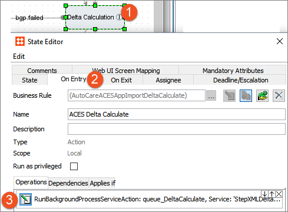
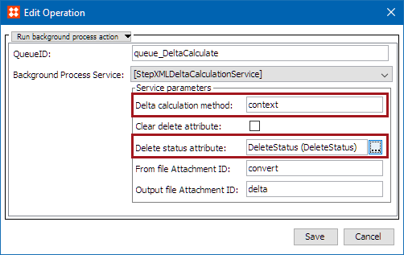

5. Update Delete Status Attribute and Delta Calculation Method in Import Workflows
==================================================================================

Setup actions 5 - 8 are all carried out within the workflows and do not
need to be done sequentially. Therefore, you can make all changes within
a given workflow simultaneously to avoid opening and editing each
workflow repeatedly.

PRODOC note: The reason that the delete information is here is because
you would reasonably expect the system to carry out deletions if the
file indicates it, but it does not carry out deletions. So that has to
be explained early to users as otherwise the import doesn't function as
expected.

Each workflow has a Delta Calculation state where the system evaluates
the content of the import file as compared to the content of the
database, or against the previously loaded file of that type. For data
that is determined to require deletion, the importer does not actually
delete the data, but instead writes to an attribute that the data
*should* be deleted. This allows each customer to determine their own
strategy for managing deletions, such as processing the deletions via a
workflow.

In order to enable the system to indicate data for deletion, the
attribute to be used to hold the deletion information must be specified.
A single attribute can be used for all imports, or unique attributes can
be created to store deletion status for varying objects or imports. In
either case, when an importer determines that data should be deleted, it
writes \'true\' in the attribute indicated in the **Delete status
attribute** of the delta calculation service of that importer.
Additionally, the system must be configured to process imports by
comparing the incoming file against the database, or by comparing it
against the previously loaded file of that type. For more information
about implementing one or more delete status attributes (also known as
change flags), see the **Business Action: Set Import Status Attributes**
topic within the **Automotive Business Rule Plugins** section of the
**Automotive Reference Guide**[ here]{.mcFormatColor
style="color: Blue;"}.

Configuration Steps
-------------------

Below are the steps necessary to specify the delta calculation method
and the delete status attribute in any import workflow:

1.  Create an attribute (or verify that one exists) that can be used to
    store the delete status of an object. The attribute should be valid
    for the object(s) being managed by the import. For example, an
    attribute used in the AutoCare ACES Application Importer must be
    valid on ACES Application objects. Alternatively, an attribute used
    in the AutoCare PCdb Importer must be valid on all nodes in the PCdb
    classification hierarchy.
2.  Select a workflow, right-click, and select **Edit STEP Workflow**.
3.  Double click on the **Delta Calculation** state to open the State
    Editor. Select the **On Entry** tab and click the Edit icon on the
    existing business rule.

1.  In the Edit Operation dialog, write \'file\' or \'context\' in the
    **Delta calculation method** parameter, and on the **Delete status
    attribute** parameter to select an attribute that should be used to
    store deletion status.

### Delta calculation methods

-   **context:** Compares the data in the input file against the data in
    the database. It is recommended to use this option only as needed,
    which is when data is managed outside of the import process, or when
    import files of that type contain varying data sets. Oftentimes this
    method is required for supplier data. This method takes longer to
    process, but ensures accuracy when data management strictly via
    import cannot be guaranteed, or when datasets vary within the file
    type.

For example, because ACES files can come from multiple sources
(Suppliers or Brands), it is required that the files are imported using
\'context\' method for delta calculation so that the data is compared
against the database instead of the previously imported file. For this
reason, Easy Setup configures the \'Delta calculation method\' parameter
with \'context\' for the AutoCare ACES Import workflow.

Additionally, PIES imports may be received from various suppliers
providing data for different sets of parts. If the context method is
used, each file is compared to the data in the database and any data not
in the latest PIES file will be marked for deletion, which is not
desired when different data sets are being used.

For example, PIES imports may be received from various suppliers
providing data for different sets of parts. If the \'file\' method is
used, then each new PIES file will be compared to the previous PIES
file, and any data not in the new PIES file will be marked for deletion,
causing conflicting and undesired results when different data sets are
imported. (i.e., If Supplier 1\'s import file contains data for
PIES Item \'X,\' but Supplier 2\'s import file does not contain data for
PIES Item \'X,\' then PIES Item \'X\' should not be marked for deletion,
but if the \'file\' method is used, then PIES Item \'X\' would be
deleted. However, using the \'context\' method resolves this, because
each Suppliers file is compared to the existing data in the database,
instead of the previous import file.)

The context method is required for the following: AutoCare ACES Import
Workflow (because of the ACES Complete Replacement functionality,
whether or not the data is managed strictly via import), NAPA
Application Import workflow, and NAPA Interchange Import workflow.

-   **file:** Compares the data in the input file against the data in
    the last loaded file of the same type. It is recommended to use this
    option whenever possible as it has a performance advantage over the
    context method. The file method is suitable for any format where the
    data is managed strictly via import and contains consistent data
    sets, as is often the case for reference data.

For example, a PCdb file always contains all data for the PCdb. If a
part terminology is not present in the current file, it is because it
has been removed from the PCdb. Using either the file or the context
method would result in the missing part terminology being appropriately
marked for deletion, but as the data set is consistent and usually only
managed via import, the file method is preferred to take advantage of
the faster processing time.

The above action of setting the delete status attribute serves only to
configure the attribute that will store the deletion. Each
implementation should further determine a process for managing deletions
for each import.

If users want to track new / change / delete flags for PIES objects as
well as use replacement rules to update PIES attribute values and data
container values, the PIES importer Delta calculation method parameter
must be set to **\'context\'**. And if users want to track only the new
or changed objects (without deleted objects), and also use replacement
rules, the PIES importer Delta calculation method parameter must be set
to **\'file\'**.

The PIES Importer can mark only the PIES Item, PIES Package, and PIES
HazMat objects for deletion. PIES Interchange objects will not be
handled to be marked for deletion because interchange objects are shared
between multiple suppliers. . Also, the PIES Product Hierarchy objects
(PIES Brand / PIES PCdb Category / PIES PCdb Sub Category / PIES PCdb
Part Terminology) will not be handled to be marked for deletionbecause
those objects could be shared by multiple PIES imports.

For more information on editing workflows and/or business rules, see the
**Workflows** ([here]{.mcFormatColor style="color: Blue;"}) and
**Business Rules** ([here]{.mcFormatColor style="color: Blue;"})
sections of the **STEP Online Help**.
