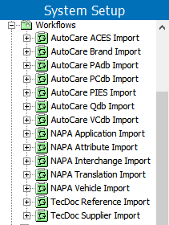

6. Update Assignees in Import Workflows
=======================================

Each import process has a corresponding workflow and all workflows are
created with a default assignee of \'stepsys.\' The workflows can be
found under the Workflows node of the System Setup tab:

Each workflow must have the assignees updated to appropriate users or
groups, either by defining a new default assignee for the workflow, or
by removing the existing default and applying specific assignees per
state.

Any users with the \'STEP Workflow Administrator\' setup action as part
of their privileges will be able to see and work with files in all
states of the workflows. To quickly get up and running with the import
functionality, it may be useful to add admin users to a group that
contains this privilege, allowing those users to familiarize themselves
with the workflow functionality while end user privileges are
determined.

The workflow administrator privilege can be applied to a setup group. If
end users should be able to access data and take action in all states of
the import workflows, the import workflows can be placed in a setup
group and users who need to import the files can be added to a user
group that contains the privilege applied to the applicable setup group.
This will allow users to have full access to the import functionality,
but only for those workflows in the setup group, leaving their access in
other workflows unchanged.

For more information on workflow assignees, see the **Assignees in
Workflows** topic ([here]{.mcFormatColor style="color: Blue;"}) within
the **Workflows** section of the **STEP Online Help**.

For more information on user groups, privileges, and setup groups, see
the **Users and Groups** section ([here]{.mcFormatColor
style="color: Blue;"}) of the **STEP Online Help**.
