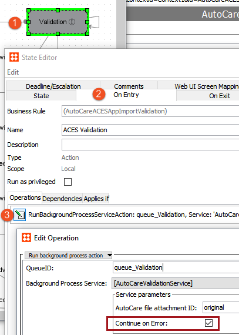

7. Determine Validation Error Handling for Each Import
======================================================

Each import has some basic format validations applied, and each
implementation must determine how these should be handled. For more
information about the Validation state, see the **Validation State**
topic of the **Importing Automotive Data** section within the
**Automotive Reference Guide**[ here]{.mcFormatColor
style="color: Blue;"}.

Otherwise, it is important to understand that the handling of validation
errors can be configured by enabling / disabling the \'Continue on
Error\' parameter on the Validation state of each import workflow. By
default, the \'Continue on Error\' parameter is disabled.

For example, when reference data includes multiple files and a data
point included in one is not present in a corresponding related file
(e.g., a PCdb Codemaster file includes a position that is omitted from
the Position file in the same PCdb), an error will be written to the
execution report of the validation process. However, as reference data
is typically managed by an outside source (e.g., AutoCare, TecDoc, or
NAPA), it may be desired to import the data regardless of these types of
errors. If so, the \'Continue on Error\' parameter should be checked on
the validation service. In this case the validations issues will still
be written to the execution report, but all valid data will be converted
and made available for the import process. If unchecked, validation
errors will cause the import process to stop and will need to be
corrected before the file can complete validation and continue on in the
import process.

Additionally, consider when an importer has a strict file name
validation rule (e.g., NAPA Vehicle and NAPA Translation Importers),
should a bad file name stop the data from being imported? If so, then
the parameter should remain disabled. If not, then the parameter should
be enabled.

For more information on how this setting changes how a users actions
when importing data, see the **Validation Error Handling** topic of the
**Automotive Reference Guide**[ here]{.mcFormatColor
style="color: Blue;"}.

Enabling / Disabling Continue on Error
--------------------------------------

Below are the steps to enable / disable the \'Continue on Error\'
parameter:

1.  When editing a workflow, double click on the **Validation** state to
    open the State Editor.
2.  Select the **On Entry** tab and click the **Edit** button on the
    existing business rule.
3.  Check or uncheck the **Continue on Error** setting as desired.

