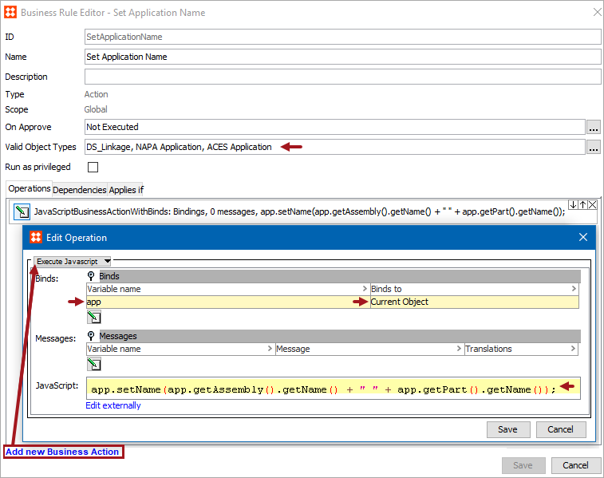
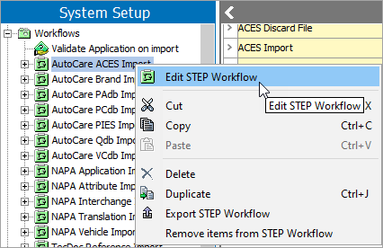
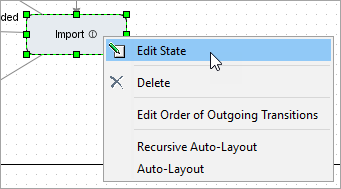
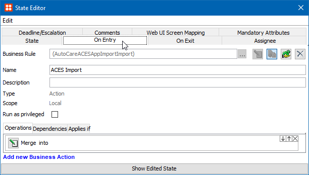
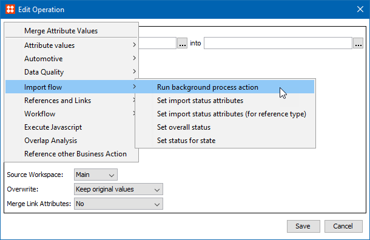
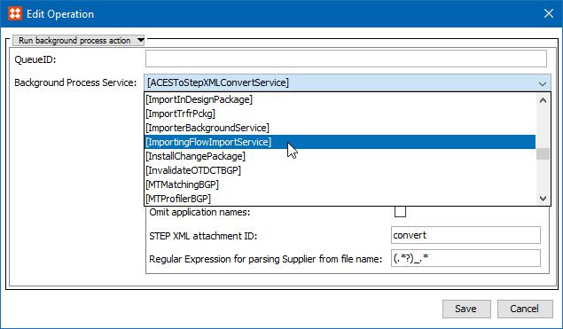
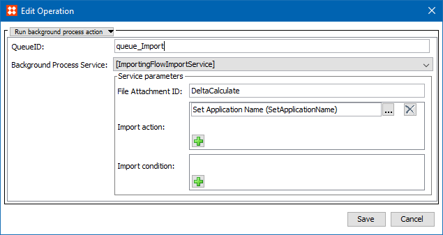

8. Specify an Application Naming Convention
===========================================

PRODOC note: MEDU RDUCST-2769

When applications are imported into STEP using the ACES, NAPA
Application, and/or TecDoc Supplier importers, the STEP Name for
applications is set to match the Part Name. However, you can specify a
naming convention for the Application Name to be set automatically
during the import process.

This is an optional configuration. If you do not have specific
requirements around your application naming convention, this setup
action can be skipped.

Prerequisites {#prerequisites conditions="Primary.Web"}
-------------

Prerequisites

Configuring a naming convention consists of creating a business action
with the provided JavaScript, and editing the \'Import\' state for the
application Import workflow of each implemented standard created during
the Easy Setup actions. For more information, see the **Business
Action** section ([here]{.mcFormatColor style="color: Blue;"}), and the
**Workflows** section ([here]{.mcFormatColor style="color: Blue;"}) of
the **STEP Online Help**.

Within this topic, two examples of JavaScript are provided that will
change the Application Name to be \[VehicleName PartName\] or \[Year
Make Model\]. The Vehicle Name is retrieved using a classification
reference type specific to each standard. Below is a list of each
standard and the classification reference used to retrieve the Vehicle
Name.

-   **AutoCare:** ACES Application To Base Vehicle
-   **NAPA:** Application To Year
-   **TecDoc:** Supplier Article To Vehicle Type (PC)

If your data model does not use the classification references listed
above, then the JavaScript provided in this topic must be modified to
work as expected.

Results
-------

When the JavaScript provided within this topic is used, instead of the
Application Name matching the Part Name, the Application Name will be a
result of the Vehicle Name and the Part Name.

In the example below, two screenshots of the same application are
displayed. In the screenshot on the left, the Application Name
(034-VC21499) is displayed beneath the Part with the same name. Whereas
in the screenshot on the right, the Application Name (2008 Acura CSX
034-VC21499) has been automatically updated during import to include the
AutoCare Base Vehicle Name (2008 Acura CSX) and Part Name (034-VC21499).
The result is the application named displays below the Part Name
\'034-VC21499.\'


Configuring an Application Naming Convention
--------------------------------------------

To specify a more desirable application naming convention, a new
business action to set the Application Name on import needs to be
created, and the \'Import\' state for the respective workflow must be
edited to utilize the newly created business action.

### Create a business action to set the Application Name on import

Below are the steps for creating a business action with the provided
JavaScript to set the Application Name on import to \[VehicleName
PartName\]. For more information on creating a business rule, see the
**Creating a Business Rule or Library** topic ([here]{.mcFormatColor
style="color: Blue;"}) of the **Business Rules** section of the **STEP
Online Help**.

1.  Create a business action using the \'app\' variable that binds to
    \'Current Object.\'
2.  Add one of the following JavaScript options:

**Option A:** Displays the \[Year Make Model\]

``` {space="preserve"}
app.setName(app.getAssembly().getName());
```

**Option B:** Displays the \[Year Make Model PartName\]

``` {space="preserve"}
app.setName(app.getAssembly().getName() + " " + app.getPart().getName());
```

In the example below, the business action (Set Application Name) is
configured to work with the AutoCare, NAPA, and TecDoc standards by
selecting the respective Valid Object Types.


### Add the business action to the \'Import\' state of the respective Import Workflow

Once a business action has been created with JavaScript, as shown above,
the business action needs to be added to the \'Import\' state of the
respective import workflow.

1.  Go to System Setup \> Workflows \> Select the workflow used by the
    importer.

For the business action example provided above, the configured valid
object types allow for the business action to be used in one or more of
the following import workflows: AutoCare ACES Import, NAPA Application
Import, and TecDoc Supplier Import.

1.  Right-click the respective workflow, select **Edit STEP Workflow**,
    and the STEP Workflow Designer will display.



1.  Within the STEP Workflow Designer, right-click the **Import** state,
    select **Edit State**, and the State Editor will display.



1.  Within the State Editor, click the **On Entry** tab (as shown
    below).



If a business action using the \'Run background process action\' has
been previously added to this state, then click the **Edit Operation**
button and skip to step 11 below.

1.  Click the **Edit Operation** button, and the Edit Operation dialog
    will display.
2.  Click the operation dropdown, hover over Import flow, and select the
    **Run background process action** (as shown below).



1.  Use the Background Process Service parameter dropdown to select
    **\[ImportingFlowImportService\]**, as shown below.



1.  Once the \[ImportingFlowImportService\] Background Process Service
    is selected, the Edit Operation dialog will display.
2.  **QueueID:** Specify the queue in which the background process
    should run.
3.  **File Attachment ID:** Must be populated with the same value found
    in the \'Output file Attachment ID\' parameter of the Delta
    Calculation State.
4.  Within the \'Import action\' parameter, click the green icon (
     ) to add
    an action.
5.  to find and select the business action created to set Application
    Names on import.

Below is an example of how the operation should look prior to saving.



1.  Click the **Save** button, and close the STEP Workflow Designer.
