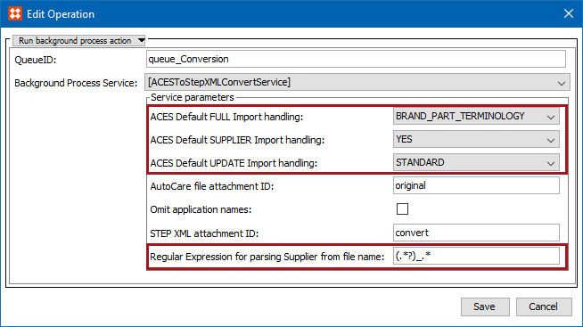
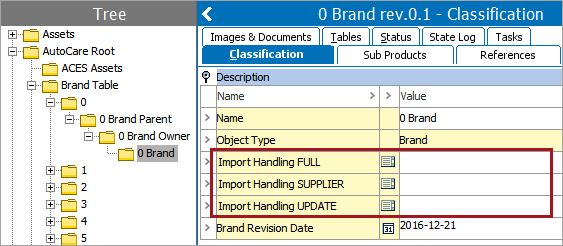

9. Specify Complete Replacement Handling (ACES Import Workflow Only)
====================================================================

This setup action is only required if the AutoCare standard is being
configured, and only needs to be carried out within the ACES
functionality. If the AutoCare standard is not being configured, this
setup action can be skipped.

ACES Complete Replacement functionality requires use of the context
method, as described in setup action 5 within this guide.

The ACES standard specifies two file load types, indicated via the
\'SubmissionType\' field in the header: FULL and UPDATE. At a high
level, FULL means \"replace what is in the system with what is in this
file\" while UPDATE means \"only update the records in the file, by
adding or deleting as indicated in the action code on each record.\" In
practice though, ACES files usually contain sets of application records
for a brand, product line, part type, supplier, etc. so the replacement
concepts need to be more granularly specified to indicate the level at
which the applications should be replaced or updated.

Configuration Steps
-------------------

To configure ACES application import handling:

1.  Verify that the delete status attribute has been populated as
    described in step 5.
2.  Double click on the **Conversion** state to open the State Editor.
    Select the **On Entry** tab and click the Edit icon on the existing
    business rule.
3.  Populate each of the ACES parameters in the business rule. These
    parameters specify the global handling for ACES files across the
    full system and the options for population are defined below. Note
    that each Brand can also have unique handling applied, which is also
    further described below.



1.  Optionally, populate the \'Regular Expression for parsing Supplier
    from file name\' parameter (using the JavaScript regular expression
    format) to specify how the Supplier value should be extracted from
    the ACES file name. By default, the parameter is populated with
    **(.\*?)\_.\***, meaning that the system will extract the first
    string prior to an underscore (typically a Supplier value) in the
    file name as this is how the ACES standard defines the naming
    convention. For example, with a file name of
    ACMESupply\_BrakeHardware\_2016-04-23\_FULL.xml, \'ACMESupply\'
    would be extracted as the Supplier value. If this is not desired, a
    Regular Expression can be inserted in the parameter to extract
    Supplier in an alternate way.**PRODOC note**: Changing the value to
    .\*\_(.+?)\_.\* parses what is between the 1st and 2nd underscore
    (if there are only 2 underscores. If there are 2, it takes what is
    between the 2nd and 3rd). Can be updated however the user needs
    though to get the right information from the file name.
2.  Optionally, enable the Omit application names parameter. When
    enabled, application names will be omitted during the conversion
    process so that the record will not be included in the delta file.

If the SUPPLIER parameter is set to \'Yes\' and Supplier cannot be
parsed from the file name, the file will fail during the Conversion
process and will be unable to be imported.**PRODOC note:** RDCUST-2207
changed this in 8.2mp1 (previously it would import).

ACES Parameter Options
----------------------

The values supplied in the conversion service specify the global system
defaults. Each Brand can also have local values applied for handling
that Brand specifically.



If a Brand does not have local values applied, the system defaults are
used. The options for populating each parameter are the same, regardless
of whether they are provided in the global or local parameters.

### FULL

The FULL parameter defines how files with a SubmissionType=FULL are
handled. The options are:

-   **Brand:** Replacement of application records is within the brand.
    All applications for all brands in the input file are replaced (with
    or without regard to the Supplier, as per the value in that
    parameter), regardless of part terminology.
-   **Brand + Part Number:** Replacement of application records is
    within the brand and part number. All applications for a particular
    brand are replaced for all part numbers that are in the input file
    (with or without regard to the Supplier, as per the value in that
    parameter). Applications for part numbers that are NOT in the input
    file are left untouched.
-   **Brand + Part Terminology:** Replacement of application records is
    within the brand and part terminology. All applications for a
    particular brand are replaced for all part terminologies that are
    present in the input file (with or without regard to the Supplier,
    as per the value in that parameter). Applications for part
    terminologies NOT in the input file are left untouched.

### SUPPLIER

The SUPPLIER parameter defines whether or not Supplier is taken into
consideration when evaluating replacement scenarios. If multiple
suppliers can provide records for the same Brand, and suppliers should
not overwrite one another\'s records, this should be set to \'Yes.\' If
only a single supplier provides records for a given Brand, or suppliers
are allowed to overwrite one another\'s data and only the most current
data (regardless of supplier) is desired, this should be set to \'No.\'

Note that both the FULL and UPDATE parameters work in conjunction with
the SUPPLIER parameter, for which the options are:

-   **No:** Replacements for this brand will replace applications
    records across all Suppliers, regardless of who provided the
    existing application records. In other words, do NOT take Supplier
    into account when evaluating replacements.
-   **Yes:** Replacements for this brand will only replace application
    records provided by the Supplier in the input file. In other words,
    DO take Supplier into account when evaluating replacements. With
    this setting, it is important to ensure the Supplier can be
    accurately parsed from the file name.

Supplier handling must be consistent within a Brand. Changing the
Supplier setting in a Brand will have unintended consequences (e.g., the
Supplier-based records will be duplicates of the non-Supplier ones). If
it does need to change for a Brand, it is recommended to delete the
existing records first and then do a full re-load of all records for the
Brand.

### UPDATE

The UPDATE parameter defines how files with a SubmissionType=UPDATE are
handled. The options are:

-   **Partial Replacement:** Evaluate the combinations of Brand, Part
    Terminology, and Base Vehicle of each record provided in the file.
    For each combination found, replace all records in the database with
    those in the input file (with or without regard to the Supplier, as
    per the value in that parameter). This is essentially an additional
    variation of the FULL scenarios, but is used for UPDATE files only,
    to \"update all records for this set of vehicles and part types.\"

```{=html}
<!-- -->
```
-   **Standard Update:** Delete records with action=\"D\"; Add records
    with action=\"A.\" Only records explicitly in the file will be acted
    on (with or without regard to the Supplier, as per the value in that
    parameter).
