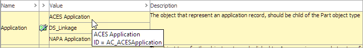
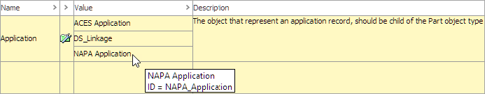
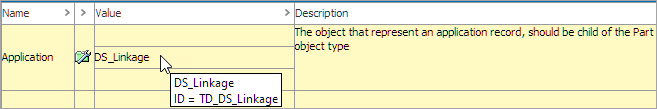
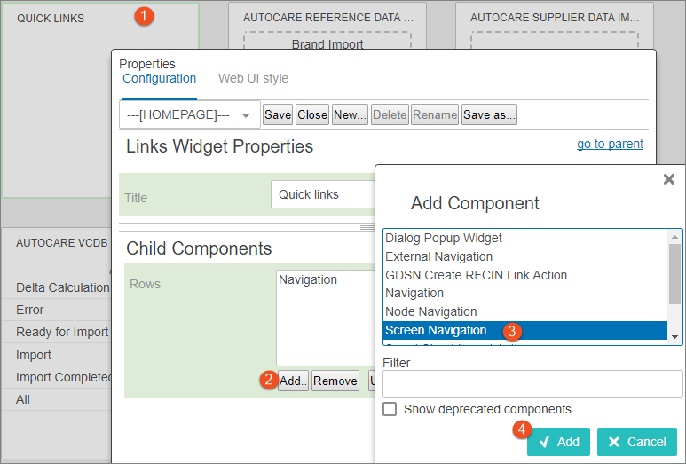
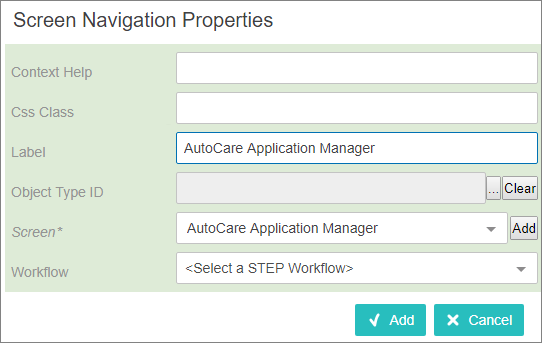
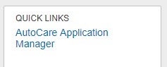

Accessing Application Editor and Manager Screens
================================================

Within each standard, Easy Setup creates multiple screens that can be
used for viewing and editing application records. Each of the standards
and their out of the box screens are described below. Though these
screens can be customized as needed, this topic describes each of the
screens created across the different standards (AutoCare, NAPA and
TecDoc) and steps for adding the Application Manager screen to the Links
Widget.

AutoCare

Each of the automatically configured screens for the AutoCare solution
are described below:

-   **AutoCare Application Editor Screen (Parts):** A screen for viewing
    / editing application records when a part is selected.
-   **AutoCare Application Editor Screen (Vehicles):** A screen for
    viewing / editing application records when a vehicle is selected
-   **AutoCare Application Manager Screen:** A screen for viewing /
    editing application records where users input vehicle, part type,
    and/or part number selections to search for application records, and
    optionally search for missing coverage on the input selections

When Easy Setup actions are completed, the Automotive - Application
Model is populated with the following value IDs related to these
screens:

-   Application Records = AC\_ACESApplication
-   Vehicles / Assemblies = AC\_BaseVehicle
-   Part Types = AC\_PartTerminology

In the example below, the Application parameter is displayed within the
Automotive - Application Model component model configured with the ACES
Application (AC\_ACESApplication) value. When Easy Setup actions are
completed, the component model is configured automatically.

For the Application Editor and/or Manager screens to properly function,
the desired object types must be configured within both the component
model and the Web UI screens.

NAPA

Each of the automatically configured screens for the NAPA solution are
described below:

-   **NAPA Application Editor Screen (Parts):** A screen for viewing /
    editing application records when a part is selected.
-   **NAPA Application Editor Screen (Vehicles):** A screen for viewing
    / editing application records when a vehicle is selected
-   **NAPA Application Manager Screen:** A screen for viewing / editing
    application records where users input vehicle, part type (MPCC),
    and/or part number selections to search for application records, and
    optionally search for missing coverage on the input selections

When Easy Setup actions are completed, the Automotive - Application
Model is populated with the following value IDs related to these
screens:

-   Application Records = NAPA\_Application
-   Vehicles / Assemblies = NAPA\_Year
-   Part Types = NAPA\_MPCC

In the example below, the Application parameter is displayed within the
Automotive - Application Model component model configured with the NAPA
Application (NAPA\_Application) value. When Easy Setup actions are
completed, the component model is configured automatically.

For the Application Editor and/or Manager screens to properly function,
the desired object types must be configured within both the component
model and the Web UI screens.

TecDoc

Each of the automatically configured screens for the TecDoc solution are
described below:

-   **TecDoc Application Editor Screen (Articles):** A screen for
    viewing / editing application records when an article is selected.
-   **TecDoc Application Editor Screen (Assemblies):** A screen for
    viewing / editing application records when an assembly is selected
-   **TecDoc Application Manager Screen:** A screen for viewing /
    editing application records (where users input vehicles or
    assemblies and/or part types (TD generic article) selections to
    search for application records, and optionally search for missing
    coverage on the input selections.

When Easy Setup actions are completed the Automotive - Application Model
is populated with the following value IDs related to these screens:

-   Application Records = TD\_DS\_Linkage
-   Vehicles / Assemblies = TD\_VehicleType(PC), TD\_VehicleType(CV),
    TD\_EngineCode
-   Part Types = TD\_StandardAssemblyGA, TD\_UniversalAssemblyGA

In the example below, the Application parameter is displayed within the
Automotive - Application Model component model configured with the
TecDoc Application (TD\_DS\_Linkage) value. When Easy Setup actions are
completed, the component model is configured automatically.

For the Application Editor and/or Manager screens to properly function,
the desired object types must be configured within both the component
model and the Web UI screens.

Each of the above screens are created by Easy Setup and mapped to the
following object types:

-   AC\_Basevehicle
-   AC\_PIESITEM
-   NAPA\_Year
-   NAPA\_Product
-   TD\_VehicleType(PC)
-   TD\_DS\_SupplierArticle

However, it is up to each implementation to make them available to all
the necessary object types.

The Application Editor screens require an object selection, so these
screens need to be mapped for a particular object type or added on a tab
within another screen that is mapped to the appropriate object. To map
the Parts or Vehicles screen directly (meaning that when you are on a
part or vehicle, you will only see that screen) see the **Mappings**
topic within the **Main Properties Overview** section of **STEP Online**
**Help**[ here]{.mcFormatColor style="color: Blue;"}.

To add the Parts or Vehicles screen to an existing screen, use the Sub
Screen Tab Page configuration, described in the **Tab Pages** topic in
the **Web User Interfaces / Web UI Getting Started** documentation of
**STEP Online Help**[ here]{.mcFormatColor style="color: Blue;"}.

The Application Manager screen does not require an object selection, so
this needs to be made accessible to users, which can easily be done by
adding a link to the screen on the homepage.

To add access to the Application Manager screen from the homepage, use
the Links widget, which is configured as part of Easy Setup. For more
information about the Links Widget, see the **Homepage Widgets** topic
in the **Web User Interfaces / Web UI Getting Started** documentation of
**STEP Online Help**[ here]{.mcFormatColor style="color: Blue;"}.

Adding an Application Manager Screen to a Links Widget
------------------------------------------------------

If Easy Setup actions for the AutoCare, NAPA, or TecDoc solution have
been completed as described in the Automotive Quick Start Guide, then
the links to the standard specific Application Manager screens will
automatically be added to the Quick Links Homepage Widget as shown in
the examples below. Otherwise, the following steps can be used to
complete configuration.

1.  In design mode, select the **Links Widget** from the Homepage
2.  Click the **Add** button
3.  Select **Screen Navigation**
4.  Click the **Add** button.

1.  Add a **Label** that will display as a clickable link in the Links
    widget, select the appropriate Search screen, and click the **Add**
    button

In the screenshot below, the Label and Screen parameters are populated
with the value \'AutoCare Application Manager.\'

1.  The result will be that the Links widget in the homepage will now
    include a link directly to the Application Manager screen.

Additional information on the Links Homepage widget, and its
configurations, is available in the **Homepage Widgets** section within
the **Web User Interfaces / Web UI Getting Started** documentation of
**STEP Online Help**[ here]{.mcFormatColor style="color: Blue;"}.
