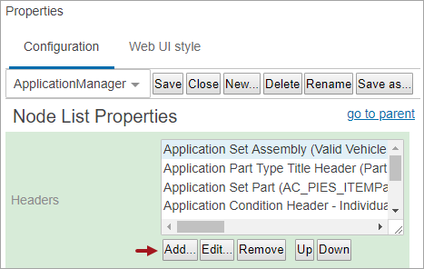

Adding Additional Headers to Application Screens
================================================

All three of the application manager screens described in the previous
section are usable as-is, once they have been made accessible following
the previous instruction. However, they are intended as \'starter\'
screens only, meaning that it is expected that users will want to see
additional data on them, which can easily be added via configuration.

Each of the application manager screens uses a Node List. Configuration
of the Node List component is covered in detail in the **Node List
Component** documentation in the **Web User Interfaces / Web UI Getting
Started** documentation of the **STEP Online Help**[
here]{.mcFormatColor style="color: Blue;"}. Within the Node List Headers
parameter, users can choose any number of columns / headers to apply to
the table view. Many of the most commonly used header components are
covered in the STEP Online Help. Access the Node List Properties in the
designer, and click the **Add** button to add additional headers to the
screen.

Below are tips for adding headers within the Automotive model:

-   Be aware of the active selection of the screen when choosing headers
    to add. For example, on the Parts screen, a part object is the
    active selection so to display data from the part itself, standard
    Web UI components such as Attribute Value Header, Name Header, and
    Reference Header can be used. However, to display data from the
    application record or vehicle when on the Parts screen, the
    Application headers must be used (e.g., Application Assembly value
    to display data from the vehicle used in the application record, or
    Application Condition Header - Group to show criteria / option data
    from the application record).
-   Most Application headers are self-explanatory via the header name
    and/or description text provided within the designer. However, there
    are two headers for which additional explanation can be helpful:
    \'Application Condition Header - Individual\' and \'Application
    Condition Header - Group.\'
-   Both are used to display data in conditions / criteria / options on
    an application record (e.g., Engine Base or Drive Type in the
    AutoCare model, Axle or Clutch Type in TecDoc, etc.).
-   The headers are differentiated by whether they display multiple
    conditions in a single column in the results table, or display
    conditions individually in their own columns.
-   **Application Condition Header - Individual**: displays all other
    populated conditions in a single header, where double-clicking in
    the cell opens a value editor where users can search for and
    populate data in the \'less important\' conditions.
-   **Application Condition Header - Group**: dynamically displays all
    conditions identified as \'important\' for the part type(s) of the
    application record(s) being displayed.

A condition is identified as \'important\' by setting the Display
Condition attribute to \'true\' on the reference between the attribute
and the part type.

Additional information on configuring these headers and the supporting
data model behind them is covered in the **Controlling Display of
Conditions in Application Manager** topic of the **Automotive Reference
Guide** found within the **Solution Enablement** section of **STEP
Online Help**[ here]{.mcFormatColor style="color: Blue;"}.

PRODOC note: MEDU RDUCST-1860 updated the name of the application
headers
