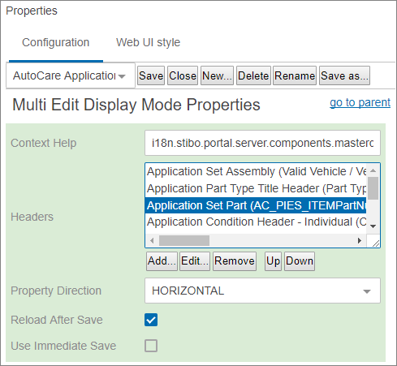
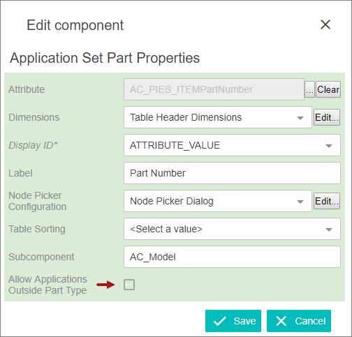

Allowing Applications Outside Part Type
=======================================

When using an Application Editor, if a part number is found using the
part type search, but the part number is being applicated to a part type
that differs from the one used to search, an error dialog will display
informing the user that the part cannot be linked because the part type
is different. In other words, when using the application editor to
applicate parts, a parts part type must match the applications part
type.

However, it is possible to override this, allowing users to select a
part number with a part type that does not match the part type searched
for application. In other words, the Application Editor will ignore the
searched part type when assigning the part number to the application.
This is helpful when working with a part that can only have a single
part type, but can be applicated for multiple part types.

Prerequisites

The new parameter will need to be added by running **Automotive -
\[Standard\] Model \> 4. Configure \[Standard\] WebUI** Easy Setup.

Enabling the Allow Applications Outside Part Type

Enabling the Allow Applications Outside Part Type {#enabling-the-allow-applications-outside-part-type conditions="Primary.Web"}
-------------------------------------------------

Below are the steps to enable the Allow Applications Outside Part Type
parameter.

1.  Go to the Application Editor\'s Multi Edit Display mode
    Properties \> Headers.
2.  Select **Application Set Part**.

1.  Click the **Edit** button, and the Application Set Part Properties
    will display.
2.  Click the checkbox for the **Allow Applications Outside Part Type**.

1.  Click the **Save** and **Close** buttons to save and close the
    designer.

PRODOC note: MEDU RDCUST-2370
