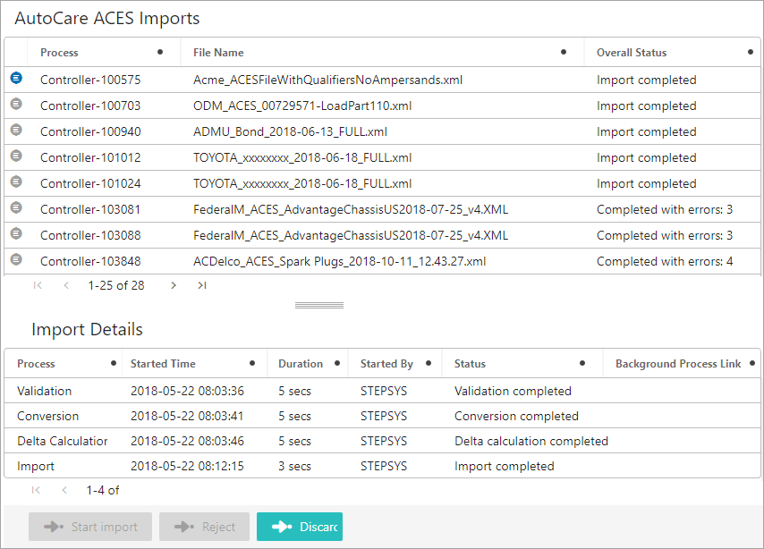
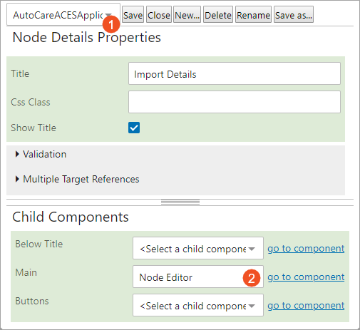
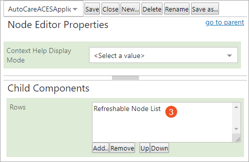
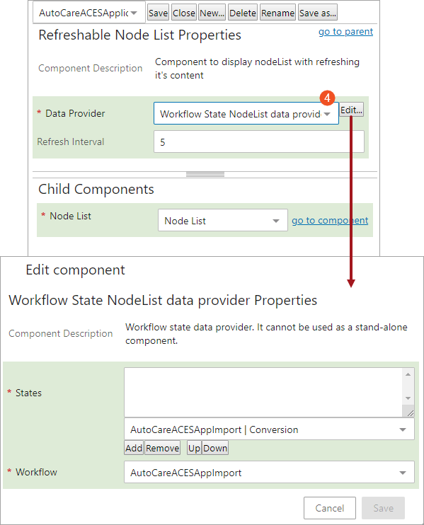
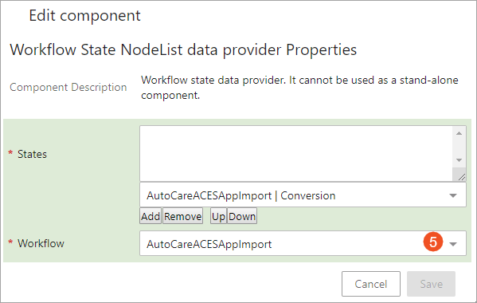
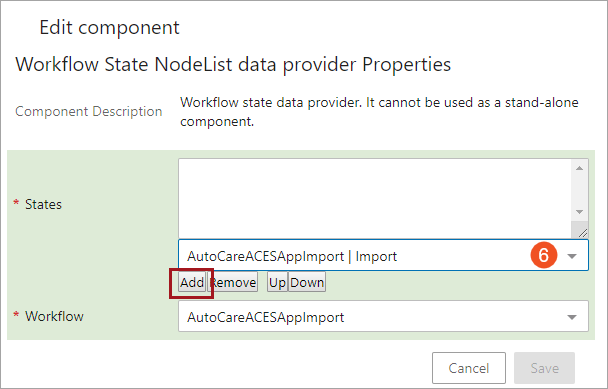
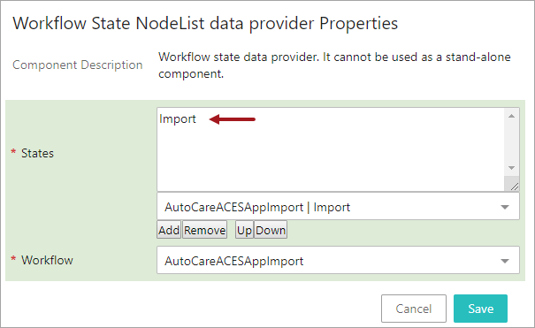
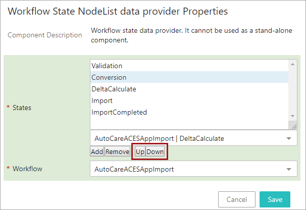
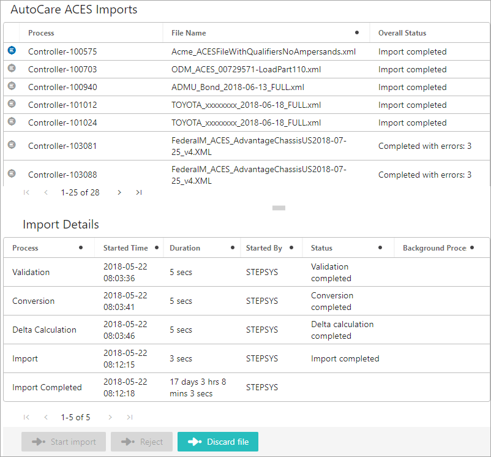

Displaying More States in Controller Screen
===========================================

The Easy Setup action is set to display a default of four workflow
states within the Import Details section in the Controller Screen. If
the user insists to view the status of the Controller, for example, time
elapsed in passing the Controller through different states, status of
the Controller in the particular state, etc., in all the workflow states
it is passing through, the user can add or remove the states that need
to be displayed. Thus, the number of workflow states that could be
displayed within the Import Details Section of the Controller screen of
any importer are configurable. This topic describes the detailed
procedure on adding or removing the workflow states displayed in the
Import Details section within the Controller screen for the selected
importer.

For the ease of explanation, we have considered AutoCare ACES Importer
Controller screen as an example to configure throughout this topic.

Adding States within Import Details section in Controller screen
----------------------------------------------------------------

Below are the steps to add states within Import Details section in
Controller screen.

1.  Open the Web UI Designer and using the screen dropdown in the upper
    left of the designer pane, select the workflow screen you would like
    to edit.

In the Automotive solution, by default a particular workflow screen is
set to display as the screen a user will get to see after clicking on
Controller in the table. This is one of the Node List configurable
feature. Hence, the adding / removing of the workflow states is to be
done in the particular workflow screen and not in the controller screen.

1.  Click the **go to component** link for the Node Editor component.

1.  Double-click the **Refreshable Node List** component to open the
    Refreshable Node List Properties.

1.  In the dropdown next to Data Provider field, select \'Workflow State
    NodeList data provider\' option and then click Edit. The \'Workflow
    State NodeList data provider properties\' window displays.

All the existing default workflow states that were available for display
gets erased when the user selects different data provider in the Data
Provider parameter. The user needs to add all the required workflow
states as described below to display the existing default workflow
states too.

1.  In the dropdown next to the Workflow parameter, select the workflow
    which the user needs to edit. In this example, AutoCare ACES
    importer workflow \'AutoCareACESAppImport\' is selected.

1.  With the required workflow selected, select the workflow state in
    the dropdown next to States parameter and then click Add.

The selected workflow state will be populated in the States field as
shown below. In the example below, the Import state is added to display.

1.  User can add more workflow states by repeating the steps mentioned
    above and also can rearrange the order of the states by using the Up
    / Down button.

1.  Click Save to close the \'Workflow State NodeList data provider
    Properties\' window, and then save and close the designer. The newly
    added workflow states shall be displayed within the Import Details
    section of the selected Controller screen.

