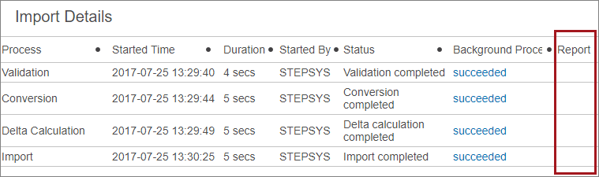
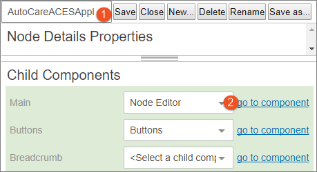
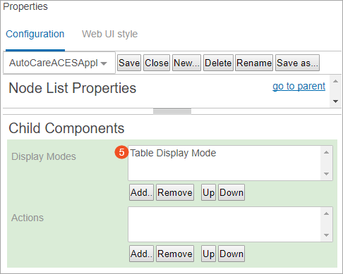
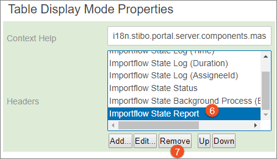

Displaying the Import Details Report Column
===========================================

A series of \'workflow\' screens are created by Easy Setup, one for each
import format. These are named \[Standard\]\[Format\]WorkflowScreen
(e.g., TecDocReferenceWorkflowScreen), and are used to display the
details of any file import.

By default, each workflow screen contains a \'Report\' column, as it is
expected that many customers will add a workflow state to evaluate data
in an incoming file and report on it. This reporting functionality can
be developed using the Extension API. Once developed, the Report column
will provide a downloadable report link for the applicable state. Users
can use the link to view and analyze the report prior to making the
decision to actually import the data within a file.

If reports will be created for the import, no action is needed. However,
if there are not any plans to develop reports, it is suggested that the
column be removed so as not to confuse end users who may then question
why a report is not available.

Removing the Report Column
--------------------------

Below are the steps to remove the Report column.

1.  Open the Web UI Designer and using the screen dropdown in the upper
    left of the designer pane, select the workflow screen you would like
    to edit.
2.  Click the **go to component** link for the Node Editor component.

1.  Double-click the **Refreshable Node List** component to open the
    Refreshable Node List Properties.

1.  Click **go to component** for the Node List to open the Node List
    Properties.

1.  Double-click the **Table Display Mode** component to open the Table
    Display Mode Properties.

1.  On the Table Display Mode Properties dialog, find the Headers
    parameter. Scroll down within the Headers parameter to locate and
    select the **Importflow State Report**.
2.  Click the **Remove** button.

