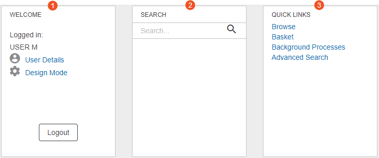
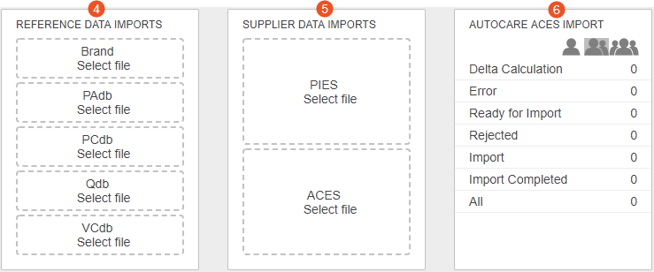
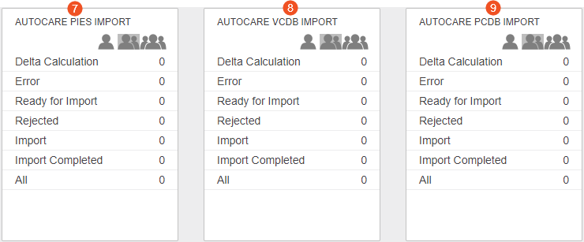
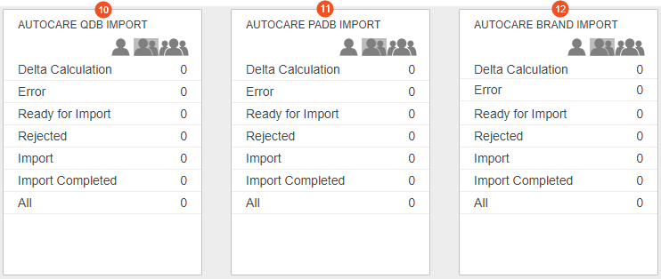
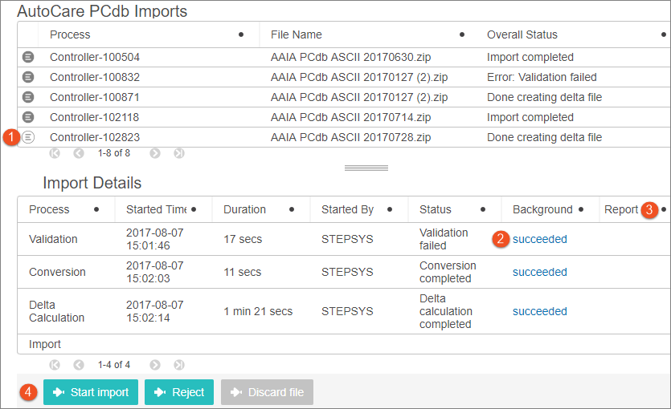

Web UI Status Selectors & Import Control Panel Screens
======================================================

Easy Setup provides a separate Web UI for each of the three supported
standards: AutoCare, NAPA, and TecDoc. One or more Web UIs will be
available, depending on configurations applied during the Easy Setup
actions.

It is expected that the Web UI administrator will modify the default
configurations to provide access to customer-specific data and processes
as needed so your Web UI may look different from what is described
below. However, it is likely that the default configurations have been
expanded upon rather than removed so you should see something comparable
to what is described. If not, contact your administrator for additional
information.

Below is an example of how the Web UI launch buttons (when created for
each of the standards) will display on the Start Page.

Clicking the applicable launch button will open your default browser and
navigate you directly to the Web UI URL.

After logging in, the Web UI homepage will display the following
widgets: Welcome, Search, Quick Links, File Loading specific to the
Standard, and Status Selectors corresponding to each importer for that
standard.

For example, the AutoCare Web UI homepage displays the following
widgets:

1.  Welcome
2.  Search
3.  Quick Links
4.  File Loading for Reference Data Imports
5.  File Loading for Supplier Data Imports
6.  Status Selector for the AutoCare ACES Importer
7.  Status Selector for the AutoCare PIES Importer
8.  Status Selector for the AutoCare VCdb Importer
9.  Status Selector for the AutoCare PCdb Importer
10. Status Selector for the AutoCare Qdb Importer
11. Status Selector for the AutoCare PAdb Importer
12. Status Selector for the AutoCare Brand Importer

This section will address the basics of what you need to know to carry
out an import within the Automotive solution.

To work with any importer, choose one of the three filter option icons
available at the top of the widget:

-    Displays items assigned
    directly to the user logged in.
-    Displays
    items assigned to the user logged in or to any group the user is
    part of.
-    Displays
    all items assigned to any user.

Once the appropriate filter is selected, then click on the state in
which you wish to view files, or click on the \'All\' state to view all
files in the workflow, regardless of state.

By default, the Validation and Conversion states are not displayed as
files usually move fairly quickly through these states and no user
intervention is required. Because of this, there is a slight delay
between loading a file and the appearance of the file in the widget. If
this is bothersome, the configuration of the status selectors can easily
be updated by the Web UI administrator to include the Validation and
Conversion states (along with any other customer-specific states).

Clicking on any state will take you to a screen that displays data for
all files in that state. Selecting an individual file will display
additional details about the file, and the available actions that can be
taken (based on the state in which it sits).

For example, when the \'All\' option on the import widget is selected,
then the import list screen can display as shown below.

1.  Click the details icon of any file to view the import details.
2.  Each completed process will include a link to the background
    process. Clicking the link will take you to a background process
    screen where you can view any errors that the process encountered.
    Note that the process can still succeed when validation has failed
    (as shown above). This occurs when schema validation is successful,
    but some allowable data errors were found and the importer is
    configured to continue when these types of errors are encountered.
3.  If customer-specific reporting has been added, links will appear in
    the Report column for any states that generate a report as part of
    the output. If customer-specific reporting has not been added, the
    Report column may have been removed by the administrator.
4.  Three actions are available, and will be enabled or disabled
    depending on the state of the file. These are further described
    below.

Available Action Buttons
------------------------

-   **Start Import:** This button is only enabled if the file is in the
    Ready to Import state. By default, this will occur after the delta
    calculation has completed and the file will have a \'Done creating
    delta file\' status. However, additional customer-specific states
    may have been added and/or the overall status setting may have been
    changed. When the \'Start import\' button is clicked, the actual
    import process starts, and the content of the delta files is
    imported. A background process link will be displayed in the table
    and clicking the link will take you to a screen where you can
    monitor status and progress of the import if desired.

The \'Start import\' button will not be enabled unless the file is in a
state from which it is legal to import (e.g., there is a \'Start
import\' transition available in the workflow from the current state).

-   **Reject:** Similar to the \'Start import\' button, the Reject
    button is only enabled if the file is in the Ready to Import state.
    The intent of the Ready to Import state is to allow users to make
    the decision as to whether or not the file should be imported. This
    is typically done by reviewing the errors (if any) generated by the
    preceding processes and/or reviewing any customer-specific reports
    that have been added. Based on the available data, if it is
    determined that the file should not be imported, then it should be
    rejected. This will put the file in a Rejected state and it will not
    be possible to import the file without reloading it.
-   **Discard file:** The option to discard a file is only available for
    files that are in the Error, Rejected, or Import Completed states as
    these are files that have already been determined not to be
    allowable for import due to errors and/or data concerns or are files
    that have already been successfully imported. Therefore no further
    work can or will be done on them within the import workflow.
    Discarding the file removes it from the import workflow and it will
    no longer show up in the list of files for that importer.
